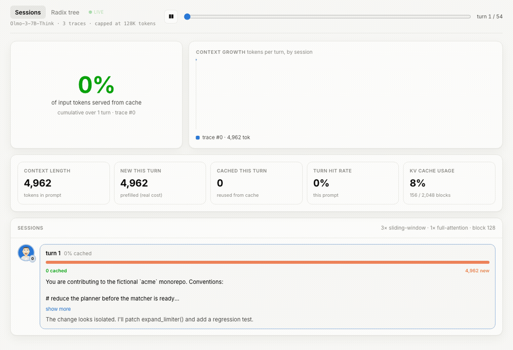

# kvlens

See how vLLM's KV cache and scheduler actually behave on real workloads — no GPU,
no model weights.



> **Live demo:** https://sagearc.github.io/kvlens/

Evaluating KV-cache behavior normally means standing up the whole model. But for
recorded traces the outputs are already known, so the weights don't matter — only
the scheduling and cache path do. kvlens replays traces through vLLM's
[native simulator](https://github.com/vllm-project/vllm/pull/47922), which loads
model *metadata* only yet runs the **real** KV-cache and scheduling code, and
shows what happens turn by turn: prefix reuse, context growth, KV-cache groups
and attention types, block store/evict. The numbers are the engine's — so you can
study large models on a laptop.

## View it

Static, no build, ships with a sample — just open it:

```bash
git clone https://github.com/sagearc/kvlens && cd kvlens
python -m http.server 8000 --directory web   # → http://localhost:8000
```

Two tabs: **Sessions** (per-turn cached vs new) and **Radix tree** (blocks shared
across sessions / evicted).

## Regenerate the data (optional)

Needs vLLM with the simulator ([#47922](https://github.com/vllm-project/vllm/pull/47922),
until it merges upstream):

```bash
VLLM_USE_PRECOMPILED=1 uv pip install -e '.[capture]'
kvlens capture --traces <trace.json> --indices 3,335,360   # ShareGPT format
kvlens serve
```

The shipped demo is **synthetic** (`examples/gen_demo_trace.py`). Real traces can
carry licensed content — never commit captures made from them (a pre-commit hook
guards `web/*.json`).

## Contributing

`make setup`, then `make serve` (no vLLM needed). Design notes live in
[AGENTS.md](AGENTS.md). PRs welcome.

Apache-2.0 · built on [vLLM](https://github.com/vllm-project/vllm) · avatars via
[DiceBear](https://dicebear.com) · AI assistance was used.
